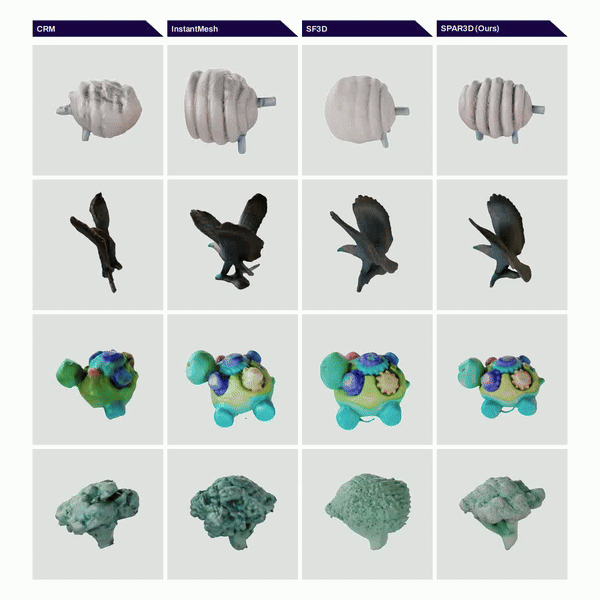

# SPAR3D: Stable Point-Aware Reconstruction of 3D Objects from Single Images

<a href="https://arxiv.org/abs/2501.04689"></a> <a href="https://huggingface.co/stabilityai/stable-point-aware-3d"></a> <a href="https://huggingface.co/spaces/stabilityai/stable-point-aware-3d"></a>

<div align="center">
  
</div>

<br>

This is the official codebase for **SPAR3D**, a state-of-the-art open-source model for **fast** feedforward 3D mesh reconstruction from a single image using a point cloud conditioning to improve the quality of the reconstruction.

<br>

<p align="center">
    
</p>

SPAR3D is based on [Stable Fast 3D](https://github.com/Stability-AI/stable-fast-3d) but improves upon the backside of the mesh by conditioning on a point cloud. This point cloud can be generated from an image using our included point cloud denoising model. This point cloud can even be edited easily in external tools or our included gradio demo. With that missing backside details can be fixed. We further improve the prediction quality of materials using novel contributions. We achieve all of this while still maintaining the fast inference speeds.

## Getting Started

### Installation

Ensure your environment is:
- Python >= 3.8 (Depending on PyTorch version >3.9)
- Optional: CUDA or MPS has to be available
- For Windows **(experimental)**: Visual Studio 2022
- For Mac (MPS) **(experimental)**: OSX 15.2 (Sequoia) and above
- Has PyTorch installed according to your platform: https://pytorch.org/get-started/locally/ [Make sure the Pytorch CUDA version matches your system's.]
- Update setuptools by `pip install -U setuptools==69.5.1`
- Install wheel by `pip install wheel`

Then, install the remaining requirements with `pip install -r requirements.txt`.
If remeshing is required, install the additional requirements with `pip install -r requirements-remesh.txt`.
For the gradio demo, an additional `pip install -r requirements-demo.txt` is required.

### Requesting Access and Login

Our model is gated at [Hugging Face](https://huggingface.co):

1. Log in to Hugging Face and request access [here](https://huggingface.co/stabilityai/stable-point-aware-3d).
2. Create an access token with read permissions [here](https://huggingface.co/settings/tokens).
3. Run `huggingface-cli login` in the environment and enter the token.

### Low VRAM Mode

To run SPAR3D with low VRAM mode, set the environment variable `SPAR3D_LOW_VRAM=1`. By default, SPAR3D consumes 10.5GB of VRAM. This mode will reduce the VRAM consumption to roughly 7GB but in exchange the model will be slower. The `run.py` script also supports the `--low-vram-mode` flag.

### Windows Support **(experimental)**

To run Stable Fast 3D on Windows, you must install Visual Studio (currently tested on VS 2022) and the appropriate PyTorch and CUDA versions.
Then, follow the installation steps as mentioned above.

Note that Windows support is **experimental** and not guaranteed to give the same performance and/or quality as Linux.

### Support for MPS (for Mac Silicon) **(experimental)**

Stable Fast 3D can also run on Macs via the MPS backend, with the texture baker using custom metal kernels similar to the corresponding CUDA kernels.

Support is only available for OSX 15.2 (Sequoia) and above.

Note that support is **experimental** and not guaranteed to give the same performance and/or quality as the CUDA backend.

MPS backend support was tested on M4 max 36GB with the latest PyTorch release and OSX 15.2 (Sequoia). We recommend you install the latest PyTorch (2.5.1 as of writing) and/or the nightly version to avoid any issues that my arise with older PyTorch versions.

You also need to run the code with `PYTORCH_ENABLE_MPS_FALLBACK=1`.

MPS currently consumes more memory compared to the CUDA PyTorch backend. We recommend running the CPU version if your system has less than 32GB of unified memory.

### CPU Support

CPU backend will automatically be used if no GPU is detected in your system. Note that this will be really slow.

If you have a GPU but are facing issues and want to use the CPU backend instead, set the environment variable `SPAR3D_USE_CPU=1` to force the CPU backend. The `run.py` script also supports the `--device=cpu` flag.

### Manual Inference

```sh
python run.py demo_files/examples/fish.png --output-dir output/
```
This will save the reconstructed 3D model as a GLB file to `output/`. You can also specify more than one image path separated by spaces. The default options takes about **6GB VRAM** for a single image input.

You may also use `--texture-resolution` to specify the resolution in pixels of the output texture and `--remesh_option` to specify the remeshing operation (None, Triangle, Quad).

For detailed usage of this script, use `python run.py --help`.

### Local Gradio App

```sh
python gradio_app.py
```


## ComfyUI extension

Custom nodes and an [example workflow](./demo_files/workflows/spar3d_example.json) are provided for [ComfyUI](https://github.com/comfyanonymous/ComfyUI).

To install:

* Clone this repo into ```custom_nodes```:
 ```shell
  $ cd ComfyUI/custom_nodes
  $ git clone https://github.com/Stability-AI/stable-point-aware-3d
 ```
* Install dependencies:
 ```shell
  $ cd stable-point-aware-3d
  $ pip install -r requirements.txt
 ```
* Optional for remeshing:
 ```shell
  $ pip install -r requirements-remesh.txt
 ```
* Restart ComfyUI

## Remesher Options:

  -`none`: mesh unchanged after generation. No CPU overhead.

  -`triangle`: verticies and edges are rearranged to form a triangle topography. Implementation is from: *"[A Remeshing Approach to Multiresolution Modeling](https://github.com/sgsellan/botsch-kobbelt-remesher-libigl)" by M. Botsch and L. Kobbelt*. CPU overhead expected.

  -`quad`: verticies and edges are rearanged in quadrilateral topography with a proper quad flow. The quad mesh is split into triangles for export with GLB. Implementation is from *"[Instant Field-Aligned Meshes](https://github.com/wjakob/instant-meshes)" from Jakob et al.*. CPU overhead expected.

Additionally the target vertex or face count can be specified. This is not a hard constraint but a rough count the method aims to create. This target is ignored if the remesher is set to `none`.

## Citation
```BibTeX
@article{spar3d2025,
  title={{SPAR3D}: Stable Point-Aware Reconstruction of {3D} Objects from Single Images},
  author={Huang, Zixuan and Boss, Mark and Vasishta, Aaryaman and Rehg, James Matthew and Jampani, Varun},
  journal={arXiv preprint},
  year={2025}
}
```
